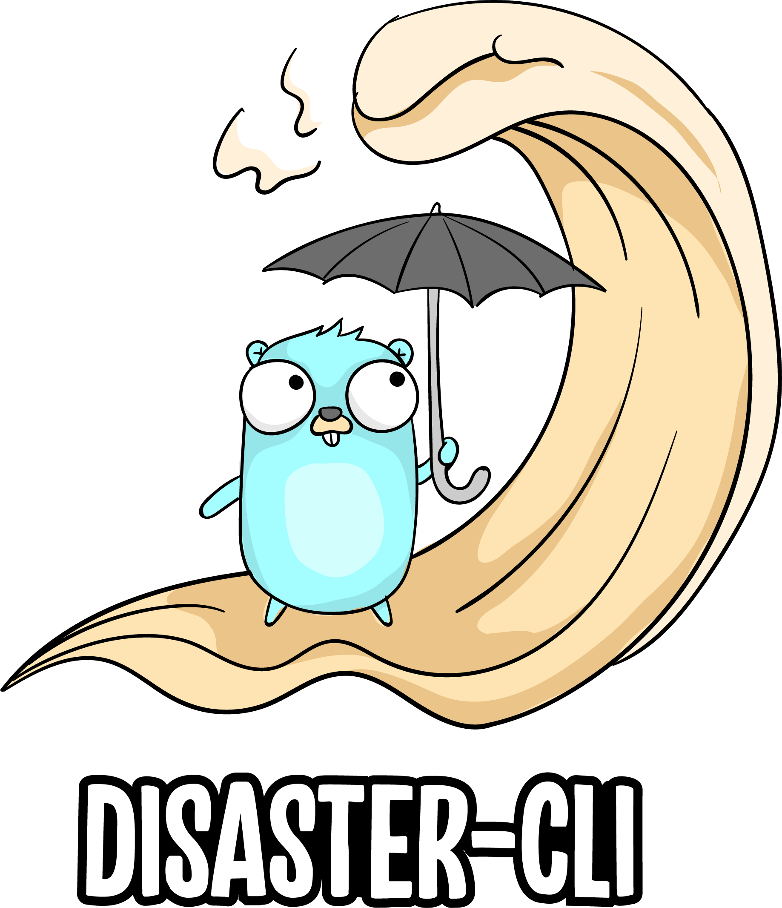

# Natural Disaster CLI
A Golang based CLI too for determining natural catastrophe near you, or a location specified. [Earth Observatory Natural Event Tracker (EONET)](https://eonet.sci.gsfc.nasa.gov/what-is-eonet) is the source for all Data.


## API Web Service Rate Limits
Limits are placed on the number of API requests you may make using your API key. Rate limits may vary by service, but the defaults are:

Hourly Limit: 1,000 requests per hour
For each API key, these limits are applied across all api.nasa.gov API requests. Exceeding these limits will lead to your API key being temporarily blocked from making further requests. The block will automatically be lifted by waiting an hour. If you need higher rate limits, contact us.

For more info visit https://api.nasa.gov/

**Note**: To generate an API key visit https://api.nasa.gov/

## Installation
Disaster-cli is distributed as a single binary. Install Disaster-cli by unzipping it and moving it to a directory included in your system's [PATH](https://superuser.com/questions/284342/what-are-path-and-other-environment-variables-and-how-can-i-set-or-use-them).


## Usage

```
disaster-cli [flags]
disaster-cli version [flags]
disaster-cli events [flags]
disaster-cli categories [flags]

```

* [disaster-cli](disaster-cli.md)	 - A CLI too for determining natural catastrophe near you, or a location specified
* [events](disaster-cli_events.md)	 - Returns all events occurring in the world at this point in time.
* [categories](disaster-cli_categories.md) - Prints all the unique categories of all the events.
* [version](disaster-cli_version.md)	 - Print the version number of disaster-cli

## Contributing to Disaster-CLI

For a complete guide to contributing to disaster-cli , see the [Contribution Guide](CONTRIBUTING.md).

Contributions to disaster-cli of any kind including documentation, organization, tutorials, blog posts, bug reports, issues, feature requests, feature implementations, pull requests, answering questions on the forum, helping to manage issues, etc.

## Helpful Links

API Documentation:  https://eonet.sci.gsfc.nasa.gov/docs/v3

Golang Framework:https://github.com/spf13/cobra

Go-pretty: https://github.com/jedib0t/go-pretty

Source: https://eonet.sci.gsfc.nasa.gov/docs/v3


UI: https://worldview.earthdata.nasa.gov/
